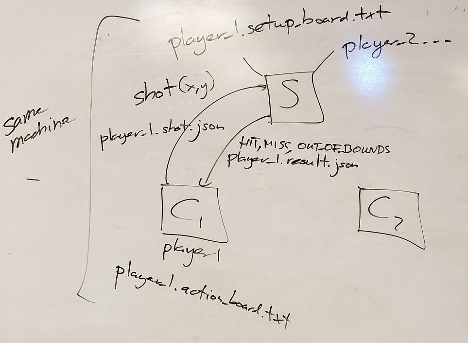

# CSCI 466 PA1 - Basic Battleship Game

## Instructions


Complete the following assignment individually.
Submit your work on D2L into the "Programming Assignment 1" folder. 

For a deeper discussion of the assignment and the code, please check out this 
[YouTube video](https://www.youtube.com/watch?v=pbCY2e1oFys).


## Learning Objectives

In this programming assignment you will:

- clone and commit to [GitHub](https://github.com/) repositories
- Learn how to build a C++ project using [CMake](https://cmake.org/)
- Learn how to test your code using [googletest](https://github.com/google/googletest)


## Overview

Your objective is to implement a basic version of the 
[Battleship](https://en.wikipedia.org/wiki/Battleship_\(game\)) 
game.
You will use the standard 
[10x10 variation of the game](https://en.wikipedia.org/wiki/Battleship_\(game\)#Description)
.
Here is an example of 
[online implementation](http://www.battleshiponline.org/) 
of the game.
*Note that the ships in that implementation have slightly different names.*

Your implementation will be a client server architecture.
This repository provides you with the header files for the client (player) and server implementations (`src/Client.hpp` 
and `src/Server.hpp`), client and server run times (`src/client_main.cpp` and `src/server_main.cpp`), and a suite of 
tests (`test/tests.cpp`).
Your job is to finish the implementation of `Client.cpp` and `Server.cpp` to pass all the tests in `tests.cpp`.


## Board Setup

The first step before the game begins is to create a *setup board* for each player, according to the 
[rules of the game](https://en.wikipedia.org/wiki/Battleship_\(game\)#Description)
.
You will represent the board with a character array, where `_` represents water and Carrier, Battleship, cRuiser, 
Submarine, and Destroyer fields are represented by `C`, `B`, `R`, `S`, `D` respectively. 
For example, your board might be set up as follows:

```
CCCCC_____
BBBB______
RRR_______
SSS_______
D_________
D_________
__________
__________
__________
__________
```

Save these boards for both players as `player_1.setup_board.txt` and `player_2.setup_board
.txt`.


## Messages

To play the game, your implementation needs to exchange two types of messages - `shot` and `result`.
The `shot` message needs to communicate the grid location of salvo.
The `result` message needs to communicate whether the salvo was a hit, a miss, or if the shot was out of bounds.

You will represent both of these messages as JSON files that the client and server exchange via local disk storage.
Assume that the x and y board coordinates are zero indexed at the top-left corner of the board and increase as you go 
right and down.


## Program Operation

The following figure illustrates the operation of the program.
(I kept the image from the lecture for continuity.)



The player fires a `shot` by writing coordinates to a `player_#.shot.json` file.
The server reads the shot file, determines the result of the shot, and writes it into `player_#.result.json`.
The player reads the result file and updates the result on its action board `player_#.action_board.json`.


## Program Invocation

To play Battleship you should first start the server by running the `run-server` executable.
Then start the player clients by running two instances of the `run-client` executable.
Unfortunately, the client and server executables will not do anything interesting until you implement `Client.cpp` 
and `Server.cpp`.
As you progress in these implementations, your code will pass more and more tests in `tests.cpp`.
When your code passes all the tests, you will be able to run the client and server executables to play the game.


## Bonus 

I will award __one bonus point__ for each of the following:  

* Server throws an error if both players start with the same player number. (implementations and tests)

* Server sends a different result when a ship is sunk. The client implementation notifies the player when they sink a
 ship (implementation and tests)

* Server detects when a game ends and returns the winner to both players. Player clients display the winner. 
(implementation and tests)


## What to Submit

Submit your work on D2L into the "Programming Assignment 1" folder. 

* A text file containing a link to a GitHub repository with your solution

* A text file alerting the TA if you implemented any of the bonus features, and if so, which ones


## Grading 

We will grade your submissions based on how many test cases in `tests.cpp` your solution passes.
Note that for grading we will use out own `tests.cpp` and full size setup board files.


